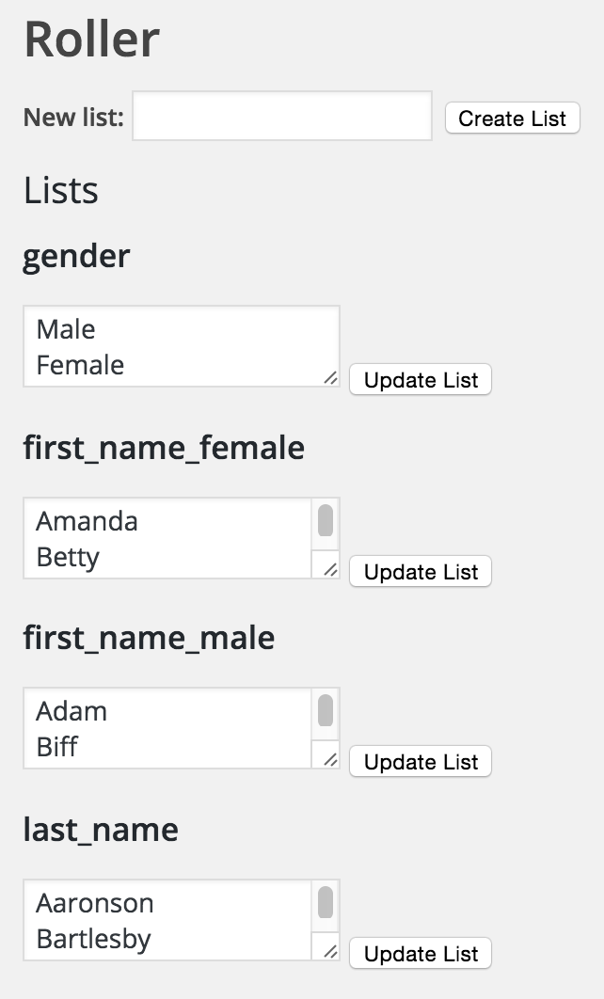

# roller
🎲 WordPress plugin for dice rolling, random lists, and conditional variables

## Roll some dice

You write:

		STR: [roller 3d6]
		DEX: [roller 3d6]
		INT: [roller 2d6+6]

The page shows:

> STR: 7  
> DEX: 11  
> INT: 17

## Save dice rolls as variables

You write:

		[roller 3d6 var=str][roller 3d6 var=dex][roller 2d6+6 var=int]

		STR: [roller_var str]
		DEX: [roller_var dex]
		INT: [roller_var int]

The page shows:

> STR: 12  
> DEX: 7  
> INT: 13

## Equations

You write:

		[roller 3d6 var=pow]
		[roller_exp pow*5 var=san]

		POW: [roller_var pow]
		SAN: [roller_var san]

The page shows:

> POW: 9  
> SAN: 45

## Conditionals and random list elements

You declare a list in the dashboard:

You write:

		[roller_choose var=gender list=gender]

		[roller_if gender=Male][roller_choose var=first_name list=first_name_male][/roller_if]
		[roller_if gender=Female][roller_choose var=first_name list=first_name_female][/roller_if]

		Name: [roller_var first_name] [roller_choose list=last_name]
		Gender: [roller_var gender]

The page shows:

> Name: Amanda Bartlesby  
> Gender: Female
